# Curso de Introducción al Testing con JavaScript

## ¿Qué es el testing? [resumen]

En el mundo actual las tecnologías con las que vivimos necesitan código, esto ha hecho que el desarrollo de software se haya vuelto industrial, donde contamos con procesos y herramientas, como el testing, que nos permiten entregar mas rápido proyectos de calidad a nuestros clientes reduciendo el riesgo de errores en producción.

### ¿Por que hacer testing?

Normalmente hay cuatro fases en el desarrollo de software para crear un producto:

**Diseño ⇒ Desarrollo ⇒ Pruebas ⇒ Producción**

En estas fases, detectar un error se vuelve cada vez mas costoso. Ahi es donde hacemos tecnicas para prevenir estas situaciones. El testing es la manera en la que nosotros gestionamos el riesgo y tratamos de evitar, en la medida de lo posible, los errores en el sistema.

#### Gestionar riesgos como Google

Análisis de código estático: Mientras desarrollamos vamos viendo nuestros resultados.
Pruebas unitarias: Nos aseguramos que el código funciona como queremos.
Pruebas de integración: Verificar que varios elementos funcionan bien trabajando juntos.
Revision de código: Equipo o persona encargada de revisar el código de las demás personas.
QA: Equipos de creación de pruebas automáticas o manuales.

## Pirámide de testing [resumen]

### La pirámide clásica del testing: _(de menos a más costoso y tendría que haber más pruebas de las primeras que de las últimas)_

- unit tests
- integration tests
- end to end tests (e2e)
- ui test: emulan el dispositivo físico

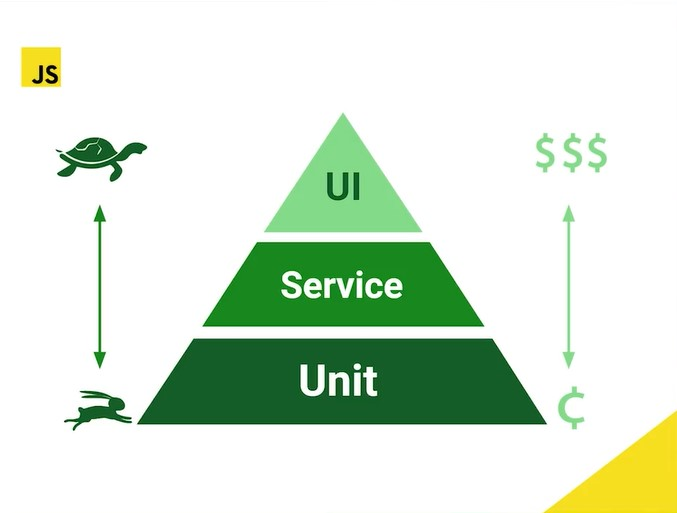
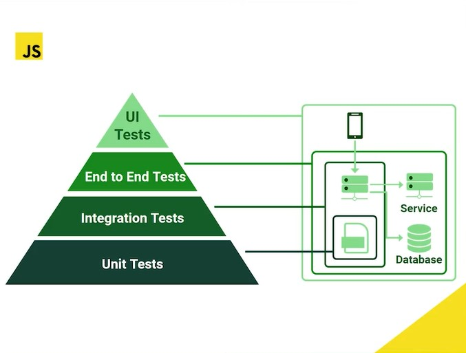
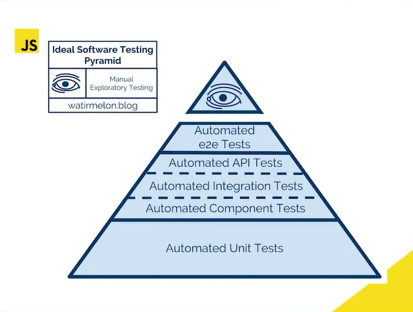
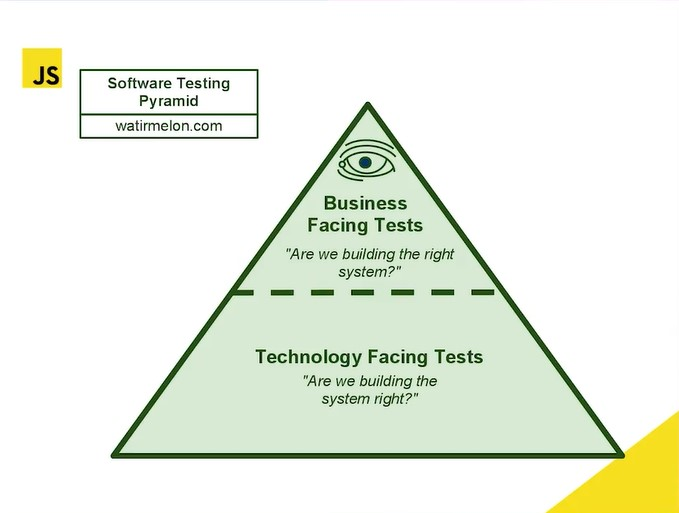

En algunas empresas se puede llegar a encontrar la pirámide invertida, un anti-patron.

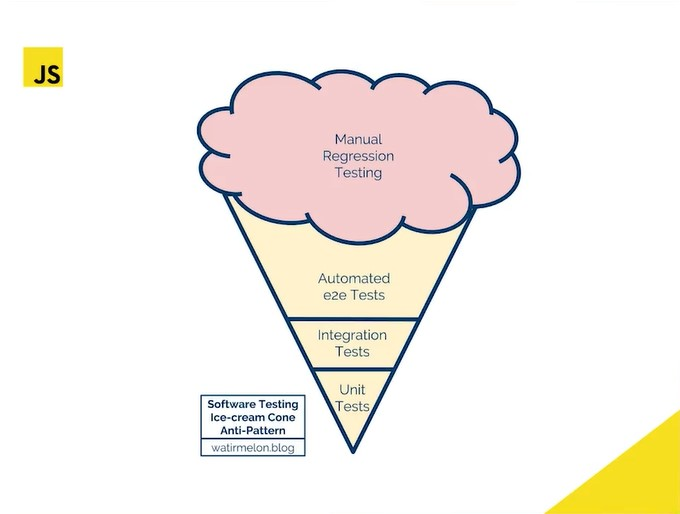

### Trofeo de tests: _(En javascript se recomienda en vez la pirámide usar un formato de trofeo)_

- static tests: el tronco (el segundo mayor número de pruebas)
- unit tests: mismo num. de pruebas que e2e y menos que static e integration
- integration tests: el mayor número de pruebas debe ser aquí
- e2e tests: mismo tamaño que unit tests y menos que static e integration

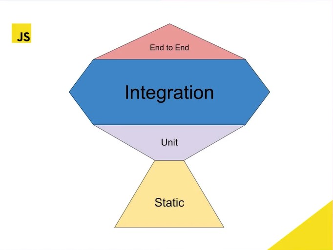

## Deuda Técnica [resumen]

Igual que en las finanzas, las deudas no son buenas ni malas, solo son una estrategia para alcanzar algo y luego se paga.

Haciendo pruebas se maneja el **riesgo**

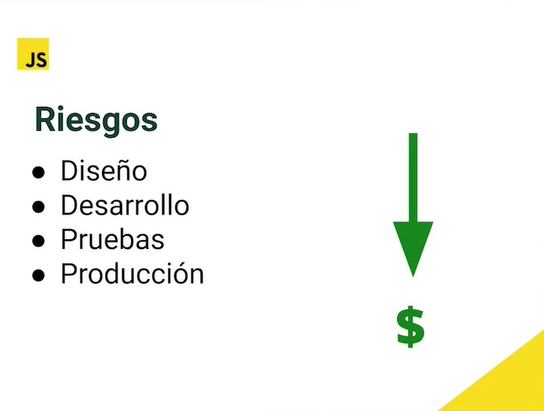

El momento y pruebas dependen de la fase en la que se encuentra la compañía:

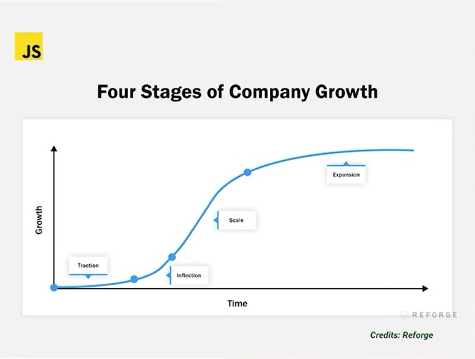

- Tracción
- Inflexión
- Escala
- Expansión

La deuda de deficiencia del desarrollador puede ser alta porque en la fase de **tracción**, la compañía busca **_(velocidad > precisión)_** , de modo que en esta etapa el testing no se valora, ya que buscan lanzar, lanzar, lanzar…

Cuando se entra a la fase de **inflexión**, hay más usuarios y se empiezan a escribir más pruebas, curando la deuda.

## Herramientas de Testing [resumen]

Estas herramientas mencionadas están clasificadas según el tipo o nivel de pruebas a realizar.

### Multipropósito o Robustas

Pueden ejecutar la mayoría de pruebas de la pirámide o trofeo, tanto para backend, frontend, integration test, algunas hasta UI y API s testing.
_Jest, *Chai, Mocha, Ava, Jasmine *_

### UI Testing

Pruebas desplegadas en un dispositivo real o simulado bajo un Browser (navegador) automatizando toques y gestos en la aplicación.
_Playwright, * Cypress, WebdriverIO, Puppeteer*_

### API Testing

En general, las APIs no tienen UI, usan protocolos de servicios por peticiones.
_Supertest, Dredd, Postman_

### Pruebas Estáticas

Estas pruebas no ejecutan el código, estas herramientas se integran al editor de código y van analizando si hay alguna mala práctica.
_ESLint, Prettier, Typescript tools (TSLint)_

**_Todas estas herramientas manejan una sola estructura (de forma), de modo que el lenguaje o framework pasa a un segundo plano_**.

## setup/Teardown [resumen]

En Jest hay cláusulas para isolar las pruebas, donde un escenario de pruebas no afecte a otro, para ello se agrupan los casos con **describe()**.

El describe nos permite crear un bloque dentro del cual agrupamos nuestras pruebas.
Podemos crear un bloque dentro de otro para organizar mejor nuestras pruebas.

Teardown se trata de demoler o quitar casos de prueba anteriores para que no afecten en el actual al usar los hooks, que son sentencias adicionales según el tiempo de ejecución del grupo o los casos.

Podemos usar con describe:

- **beforeAll()**: se ejecuta antes de todas las pruebas.
- **beforeEach()**: se ejecuta antes de cada prueba.
- **afterEach()**: se ejecuta después de cada prueba.
- **afterAll()**: se ejecuta después de todas las pruebas
- _Nota: Todas estas funciones se ejecutan dentro del alcance del scope_

## Tipos de pruebas [resumen]

### Conceptos

SUT (System Under Test - Sujeto Bajo Prueba). Por ejemplo, nuestro Person (en 06-person.js) sería nuestro SUT, no necesariamente tiene que ser un sistema.

- **Validar:** A la hora de validar resolvemos la siguiente pregunta: ¿estamos construyendo el sistema correcto?, por lo general, en la capa de requerimientos con el cliente y si le da valor a él.

- **Verificar**: Cuando ya se hacen pruebas, se verifica teniendo en mente la pregunta: ¿estamos construyendo el sistema correctamente? casi obviando que ya se produce valor al cliente.

En todas las capas se pueden hacer pruebas, incluso sin código, como en los UML o en la revisión con el equipo de Scrum.

### Pruebas Funcionales

Son las que validan que se cumplan los requerimientos de valor para el cliente (como guardar bien los buenos datos de un usuario); hasta este punto es lo que hemos hecho en VS code. Por norma general, las pruebas unitarias las entrega el desarrollador, el tester se empieza a involucrar en las pruebas de integración o E2E.

### Pruebas No Funcionales

Verifican más el óptimo manejo de los recursos del software, no el cumplimiento de requisitos persé, como lo son pruebas de: +rendimiento +carga o estabilidad +estrés +usabilidad +seguridad. Estas pruebas no necesariamente deben estar desde el principio.

- **NOTA:** _Hay una nueva área de pruebas No Funcionales que se llama **Ingeniería del caos**, su pionero es Netflix. Consiste en desconectar servicios en producción, como por ejemplo, desconectar una BD para ver como reacciona el equipo y establecer soluciones. El software que utiliza Netflix para su ingeniería del caos se llama **Chaos Monkey**_

## Metodologías

- **TDD (Test Driven Development)**: Desarrollo guiado por pruebas, donde primero se hacen las pruebas antes de escribir el código (primero los expects).

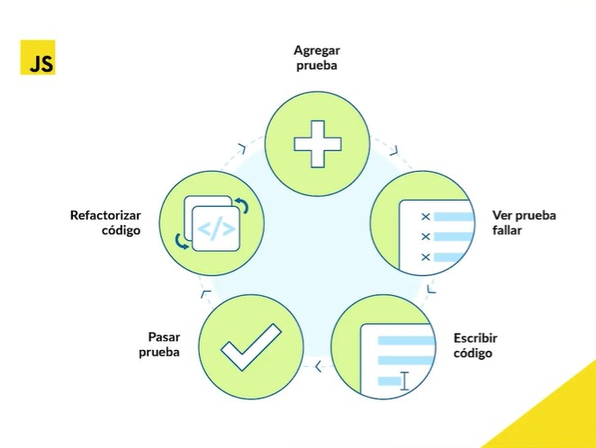

- **BDD (Behavior Driven Development)**: Desarrollo guiado por comportamiento de acuerdo a los requisitos y luego las pruebas.

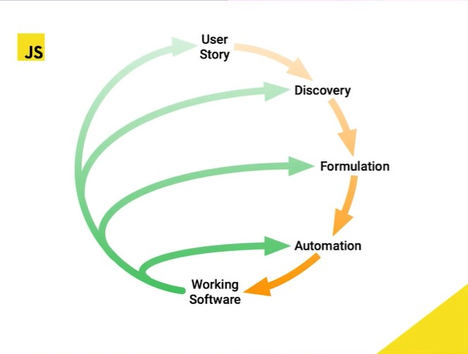

- **Patron AAA o Mantra** para hacer pruebas

  - 1er A: Arrange (Given)
  - 2da A: ejecutar Act (When)
  - 3ra A: Assert (Then)
  - Ejemplo:

```js
test("should return down", () => {
  // Arrange
  person.weight = 45;
  // Act
  const imc = person.calcIMC();
  // Assert
  expect(imc).toBe("down");
});
```

- **Falso Positivo**: Cuando una prueba indica un error, pero todo está bien, por ejemplo, testeando el método suma de 1 + 1 y pongo el expect en 5, es un falso positivo, luego la prueba está mal.

- **Falso Negativo**: Son más comunes, ya que parece que todo está normal, pero no se ha identificado el error, el set de pruebas debería ser más amplio; esto sucede cuando caemos en tan solo, probar el Happy Path, probar las condiciones en las que sabemos que el sistema funciona, por ejemplo, en el SUT de dividir las primeras pruebas salían bien porque no se tomó en cuenta la división entre cero 0, luego se hizo la prueba y el refactor. En caso de falso negativo lo mejor es aplicar TDD.

- **Sistema Legacy**: Son sistemas que te piden agregar pruebas a algo funcional, incluso en paralelo; hay que refactorizar los métodos enormes a pequeños para hacer unit test de pocos a muchos métodos; legacy no lleva una buena arquitectura.

- **Clean Architecture**: Este patrón lleva buenas prácticas desde el principio, cada método está bien dividido y con responsabilidades acertadas, es mucho más facil de agregar el set de pruebas.

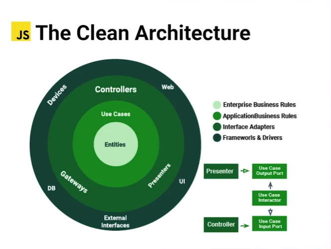
